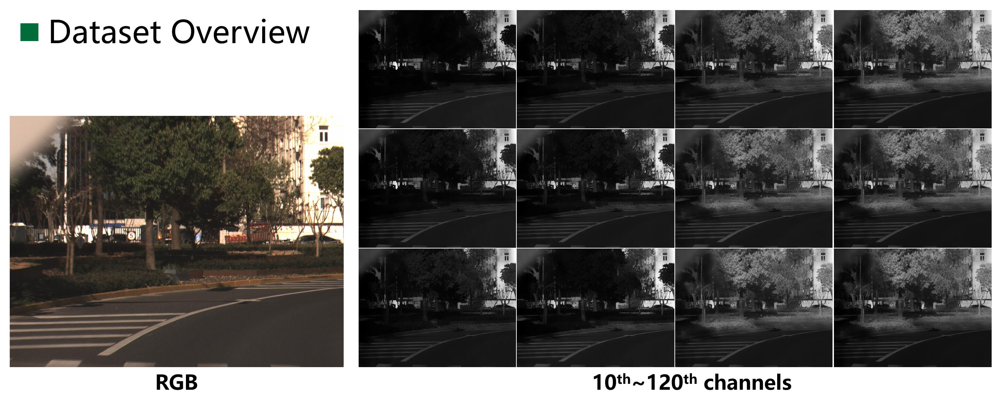

# HSI-IID-Outdoors
 This is the repository of "HSI-Guided Intrinsic Image Decomposition for Outdoor Scenes" in PBVS2022 (CVPRW2022), by Fan Zhang, Shaodi You, Yu Li and Ying Fu.

 **[Paper](https://openaccess.thecvf.com/content/CVPR2022W/PBVS/papers/Zhang_HSI-Guided_Intrinsic_Image_Decomposition_for_Outdoor_Scenes_CVPRW_2022_paper.pdf)**

## Abstract
Intrinisic image decomposition (IID) aims to recover the reflectance and shading components from images and is the prerequisite to many downstream computer vision applications, such as image editing and image relighting. Due to the inherent difficulty in acquiring ground truth reflectance and shading, existing datasets are either synthetic indoor scenes or objects using graphics rendering (e.g., CGIntrinsics and ShapeNet etc.) or real photos with very sparse manual annotation (e.g., IIW and SAW etc.). Accompanied with the complex nature of outdoor scenes, most IID methods focus on the decomposition of indoor environment. There is still a long way to go before we can handle IID of outdoor scenes. In this paper, we take the attempt to perform intrinsic image decomposition for outdoor scenes when RGB image is not the only thing we can get from the enviroment. With the observation of prior work where nir-infrared (NIR) images are transparent to a range of colourants/dyes, we propose to extend it to more spectra by collecting hyperspectral imaging (HSI) data which are well aligned with RGB images and to perform IID with both of them. We also apply existing mainstream IID methods for comparison to examine current progress and challenges at the road towards IID outdoors. We still make some improvements and find problems when performing IID for outdoor scenes, even though we do not handle it perfectly. The data we collect will be made publicly available for further potential investigation.

## HSI Datacubes

We are equipped with the LightGene Hyperspectral Camera for data collection. The camera can record the spectral information within the range of 449-955nm at the interval of 4nm, resulting in 128 channels in total. The final resolution of
RGB image and corresponding HSI data after alignment is 1889×1422 pixels and we crop them by 1600×1200 pixels for final data. After the whole collection work, we get roughly more than 26000 RGB images and corresponding hyperspectral data.  After manual filtering, there are about 4000 pairs of data and we select 260 pairs of RGB image and HSI data covering different scenes.


You can get access to the HSI data we collected via **[BaiduYun](https://pan.baidu.com/s/1PJGxjlr-ciK6b6LOiq3k1g)** with code: wd3h.



## Bibtex ##
If you find this repo useful for your research, please consider citing our paper.
```
@InProceedings{Zhang_2022_CVPR,
    author    = {Zhang, Fan and You, Shaodi and Li, Yu and Fu, Ying},
    title     = {HSI-Guided Intrinsic Image Decomposition for Outdoor Scenes},
    booktitle = {Proceedings of the IEEE/CVF Conference on Computer Vision and Pattern Recognition (CVPR) Workshops},
    month     = {June},
    year      = {2022},
    pages     = {313-322}
}
```